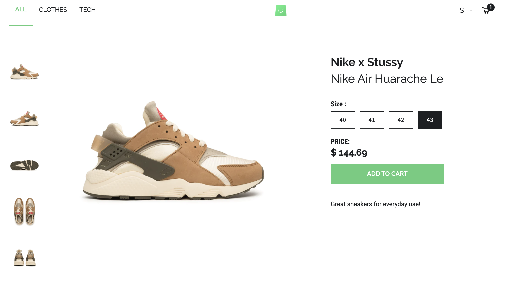

# Project description

Online store contains three categories (All, Clothes, Tech). User has an
opportunity to choose a currency, add product to the cart from different
categories or from product card. You have an opportunity to increase or decrease
quantity of product and check total sum in the cart.

## How to start it

First start the demo endpoint!

You can find the endpoint here , together with the instructions:
[GraphQL endpoint-Scandiweb](https://github.com/scandiweb/junior-react-endpoint)

Then, in the project directory, you can run:

### `npm install`

Installs dependencies.

### `npm start`
